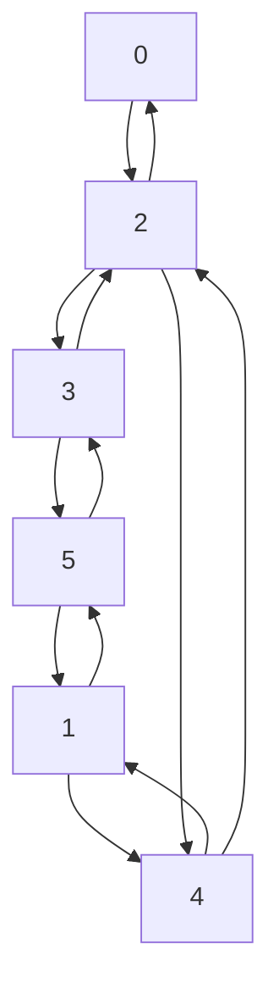
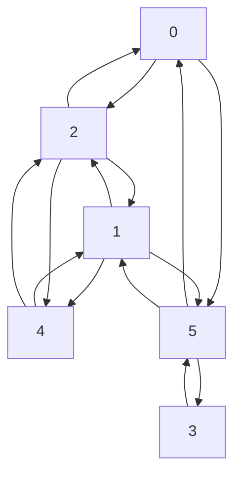

# Atividade Prática 7 - Grafos

## Definições

Para auxiliar nesta prática utilize os slides da aula de grafos. 

Vamos precisar de uma definição adicional:

    Um grafo é completo se para todo par de vértices u e v, a aresta uv existe. Em outras palavras é um grafo que possui todas as arestas possíveis. Um grafo completo de n vértices é chamado de Kn.

## Enunciado

Nesta atividade você deverá implementar um programa que:

1. Recebe uma operação a ser realizada com o grafo pela linha de comando. As operações são:
    - “-d” Dados básicos: Deve imprimir na tela, um valor por linha: a quantidade de vértices e de arestas do grafo, o grau mínimo e o máximo.
    - “-n” Vizinhanças: Deve imprimir os vizinhos de cada um dos vértices. Todos os vizinhos de um vértice devem estar na mesma linha separados por um espaço em branco e encerrando com uma quebra de linha.
    - “-k” : Deve imprimir 1 caso o grafo de entrada seja um grafo completo e 0 caso contrário.
2. Recebe os dados de um grafo pela entrada padrão.

## Leitura

A leitura dos dados do grafo se dará da seguinte forma:

1. Um inteiro n indicando quantos vértices o grafo possui.
2. As próximas n linhas contém as vizinhos de cada vértice. Um inteiro m indicando quantos vizinhos o vértice possi seguidos de m inteiros indicando cada vizinho.

## Exemplos

### Exemplos de Entrada

**Exemplo 1:**

```terminal
6
1 2
2 4 5
3 0 3 4
2 2 5
2 1 2
2 1 3
```

**Equivalência**



**Exemplo 2:**


```terminal
6
2 2 5
3 2 4 5
3 0 1 4
1 5
2 1 2
3 0 1 3
```

**Equivalência**



### Exemplos de saída

**Exemplo 1 - Entrada:**

```terminal
6
2 2 5
3 2 4 5
3 0 1 4
1 5
2 1 2
3 0 1 3
```
**Saída - A partir do comando `./pa3.out -d`:**

```terminal
6
7
1
3
```

Onde:

- 1a linha: Quantidade de vértices
- 2a linha: Quantidade de arestas
- 3a linha: Grau mínimo
- 4a linha: Grau máximo

**Saída - A partir do comando `./pa3.out -n`:**

```terminal
2 5
2 4 5
0 1 4
5
1 2
0 1 3
```

Onde:

- 1a linha: Vizinhos do vértice 0
- 2a linha: Vizinhos do vértice 1
- 3a linha: Vizinhos do vértice 2
- ...

Note que a saída das vizinhanças deve ser dada na mesma ordem em que os vizinhos aparecem na entrada.

**Saída - A partir do comando `./pa3.out -k`:**

```terminal
0
```

Onde:

- 1a linha: O grafo de entrada não é um grafo completo

## Observações

- Em C++: Você deve implementar a classe do arquivo Grafo.hpp. 
- Em ambos os casos você não deve alterar a interface das funções ou métodos(você não pode adicionar campos ou métodos a classe, nem modificar as assinaturas dos métodos ou funções), mas pode adicionar os includes de seus TADs.
- O grafo deve ser implementado utilizando uma lista de adjacência.
Sua lista de adjacência deve ser implementada utilizando Listas encadeadas.

Observações sobre a implementação das listas encadeadas:

- Você pode se basear no TAD visto em sala.
- Note que nem todas as funções do TAD visto em aula serão necessárias nessa prática, e talvez você precise implementar funcionalidades novas para seu TAD.

## Código base

```hpp
class Grafo{
    public:
        Grafo();
        ~Grafo();
        void InsereVertice();
        void InsereAresta(int v, int w);
        int QuantidadeVertices();
        int QuantidadeArestas();
        int GrauMinimo();
        int GrauMaximo();
        void ImprimeVizinhos(int v);
    private:
        ListaAdjacencia vertices;
};
```

## Submissão

A submissão será feita por VPL. Certifique-se de seguir as instruções do tutorial disponibilizado no moodle.
O seu arquivo executável DEVE se chamar pa3.out e deve estar localizado na pasta bin.
Seu código será compilado com o comando:
make all
Você DEVE utilizar a estrutura de projeto abaixo junto ao Makefile:
    
```
- PA3
    |- src
    |- bin
    |- obj
    |- include
    Makefile
```